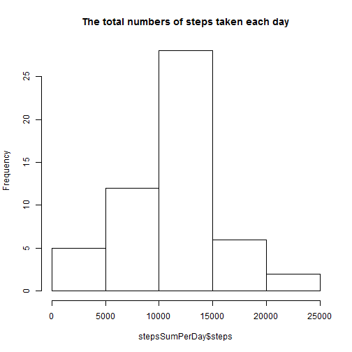
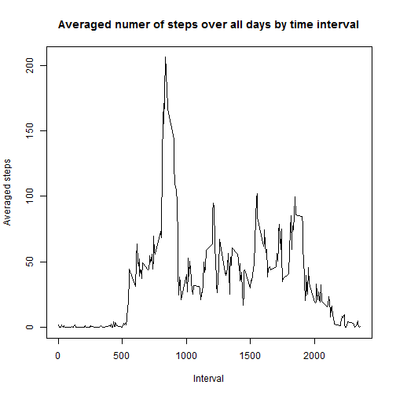
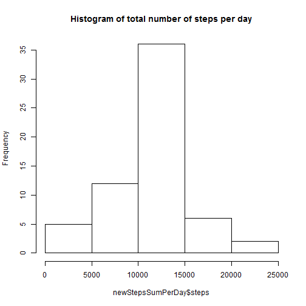
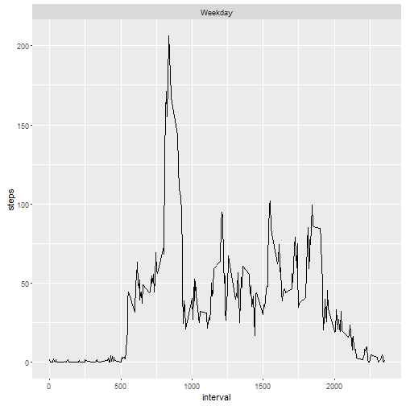

```r
require(knitr)

# set echo = TRue for other readers' reading
opts_chunk$set(echo = TRUE,fig.path = "Figures/")
```

## Loading and preprocessing the data

```r
# The data has beed downloaded into the current working directory
# The data is tidy enough and does not need to be formatted at this stage.

activityData <- read.csv(paste0(getwd(),"/activity/activity.csv"))
```

## What is mean total number of steps taken per day?

```r
# Ignore the missing values in the dataset
# use aggregate function to sum the steps of each day
stepsSumPerDay <- aggregate(steps~date, data=activityData, sum, na.rm=TRUE)

# plot the histogram of the total steps per day
hist(stepsSumPerDay$steps, main="The total numbers of steps taken each day")
```

 

```r
# calculate the mean and median of steps per day
mean(stepsSumPerDay$steps)
```

```
## [1] 10766.19
```

```r
median(stepsSumPerDay$steps)
```

```
## [1] 10765
```
So we can see the mean and median total number of steps per day are 10766 and 10765 steps respectively.


## What is the average daily activity pattern?

```r
# compute the average steps over all days by time interval
averageSteps <- aggregate(steps~interval, data=activityData,mean,na.rm=TRUE)

# plot the time series of the 5-minute interval
plot(averageSteps$interval, averageSteps$steps, type="l",
     main="Averaged numer of steps over all days by time interval",
     xlab="Interval", ylab="Averaged steps")
```

 

```r
# find the interval that contains the maximum averaged number of steps
averageSteps[which.max(averageSteps$steps),]
```

```
##     interval    steps
## 104      835 206.1698
```
It is clear that the interval of 835 has the maximum averaged number of steps.


## Imputing missing values

```r
# find and count the NAs
sum(is.na(activityData))
```

```
## [1] 2304
```

```r
# replace NAs by mean in 5 minute interval
for(i in 1:nrow(activityData)){
  if(is.na(activityData$steps[i])){
    rows <- which(averageSteps$interval == activityData$interval[i])
    activityData$steps[i] <- averageSteps$steps[rows]
  }
}
rm(rows)
# create a new dataset
newActivityData <- activityData

# aggreate steps per day and create histogram
newStepsSumPerDay <- aggregate(steps~date, newActivityData, sum)
hist(newStepsSumPerDay$steps, main="Histogram of total number of steps per day")
```

 

```r
# compute the mean and median steps per day with Nas removed
mean(newStepsSumPerDay$steps)
```

```
## [1] 10766.19
```

```r
median(newStepsSumPerDay$steps)
```

```
## [1] 10766.19
```
There are totally 2304 missing values in the dataset.

The means remain the same and the median change slightly.

## Are there differences in activity patterns between weekdays and weekends?

```r
# change the date to Date
newActivityData$date <- as.Date(newActivityData$date)
# add two columns to indicate the days and day type
newActivityData$day <- weekdays(newActivityData$date)
newActivityData$day_type <- NULL
for(i in 1:nrow(newActivityData)){
  if(newActivityData$day[i]=="Saturdy" || newActivityData$day[i]=="Sundy"){
    newActivityData$day_type[i] <- "Weekend"
  }
  else{
    newActivityData$day_type[i] <- "Weekday"
  }
}

# plot the time series
newActivityData$day_type <- as.factor(newActivityData$day_type)
newStepsSumPerDayType <- aggregate(steps ~ interval+day_type, newActivityData, mean)
require(ggplot2)
qplot(interval, steps, data=newStepsSumPerDayType, geom=c("line"))+ facet_wrap(~day_type,ncol=1)
```

 

```r
rm(list=ls())
```
